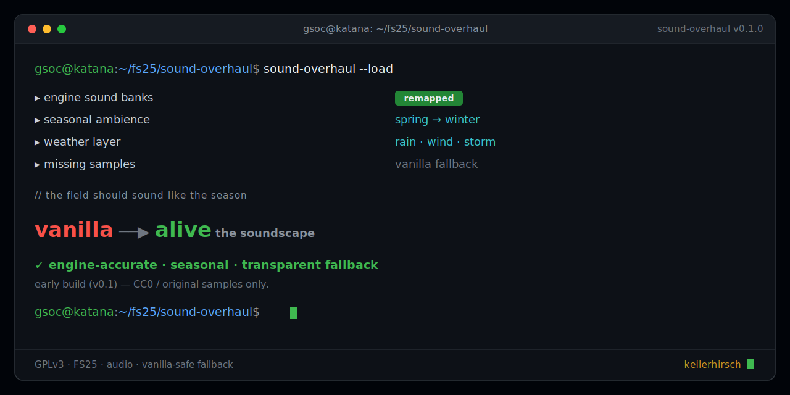

<div align="center">
  <picture>
    <source media="(prefers-color-scheme: dark)" srcset="docs/logo-dark.svg">
    
  </picture>
</div>

<p align="center"></p>

**A from-scratch audio framework for Farming Simulator 25.** It automatically
replaces vanilla vehicle sounds with a realistic, **engine-accurate** set, and adds
**seasonal / weather ambience** that follows the in-game season, weather and time of
day — a real *Hörgenuss*, with transparent vanilla fallback for anything not covered.

Part of the **…Realism** series (sibling to
[Iron Horse Realism](https://github.com/KeilerHirsch/FS25_IronHorseRealism)).

> **Foundation release (0.1.x):** the swap engine + ambience scheduler + pack loader
> + a CC0 starter-pack scaffold. The rich audio library grows from here — see
> [Roadmap](#roadmap).

## Two pillars

### 🔊 Engine-accurate vehicle sound
Every vehicle is mapped to a real **engine class** — an inline-6 turbo-diesel growl
for most tractors (the JD 8R is a 9.0 L PowerTech **inline-6**, not a V8), the
articulated giants (9R / Steiger / T9) on the big inline-6, and a **selective
Scania V8** highlight for trucks. No fake V8-everywhere. The correct I6 + turbo
whistle *is* the juicy sound.

### 🌦️ Seasonal / weather ambience
A client-side scheduler plays the right outdoor bed for **season × time of day ×
weather** — dawn chorus in spring, crickets on a summer night, rain when it rains —
and falls quiet inside the cab. Map-agnostic: it works on any map.

## How it works
- **One choke point.** Overwrites `SoundManager:createAudioSource`, the single method
  every sample loader funnels through, and swaps the file per vehicle profile. The
  engine's own RPM/load pitch modifiers keep working on the swapped sample.
- **Two-tier profile brain** (`SoundProfiles.lua`): explicit flagship overrides +
  a heuristic fallback so *every* vehicle gets a plausible sound.
- **Pluggable packs** (`PackLoader.lua`): drop a folder of `.ogg` + a `manifest.xml`
  into `sounds/packs/`. Only files present on disk are used.
- **Multiplayer-clean:** audio is client-side; only the config toggle is synced.

## Install
1. Download the latest `FS25_SoundOverhaulRealism.zip` from
   [**Releases**](https://github.com/KeilerHirsch/FS25_SoundOverhaulRealism/releases/latest).
2. Drop it into your FS25 `mods/` folder.
3. Enable it in the in-game mod list — it works out of the box. Settings persist in
   `modSettings/`; an in-game toggle GUI is on the roadmap.

## Sound packs & the one rule
Packs are pluggable — see [`sounds/packs/README.md`](sounds/packs/README.md).
**Only CC0 / public-domain / your own recordings** ever ship here. Never ripped or
"modified" vanilla/copyrighted audio. Every sample's source is logged in the pack's
`CREDITS.md`.

## Building from source
```bash
./build.sh          # produces FS25_SoundOverhaulRealism.zip (modDesc.xml at root)
busted              # run the unit tests
luacheck scripts/   # static analysis
```

## Roadmap
- Fill the starter CC0 pack (3 diesel classes + Scania V8 + seasonal beds).
- More modules on the same backbone: transmission/brakes, turbo/aux, implements.
- Optional own-recording premium pack (48 kHz, clean RPM-band loops).

## License
[GNU GPL v3 or later](LICENSE). Distributed on GitHub.
Not affiliated with or endorsed by GIANTS Software.

## Support
If this makes your farm sound better: [☕ Ko-fi](https://ko-fi.com/keilerhirsch).

---
*The Man, The Mythos, The Legend: KeilerHirsch* 🐗
